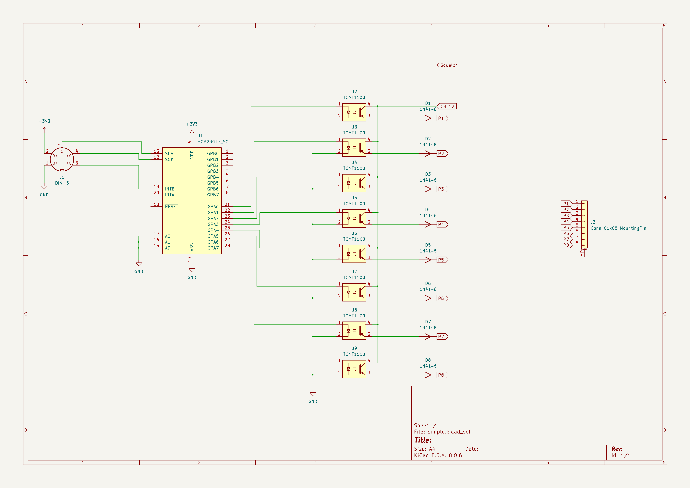
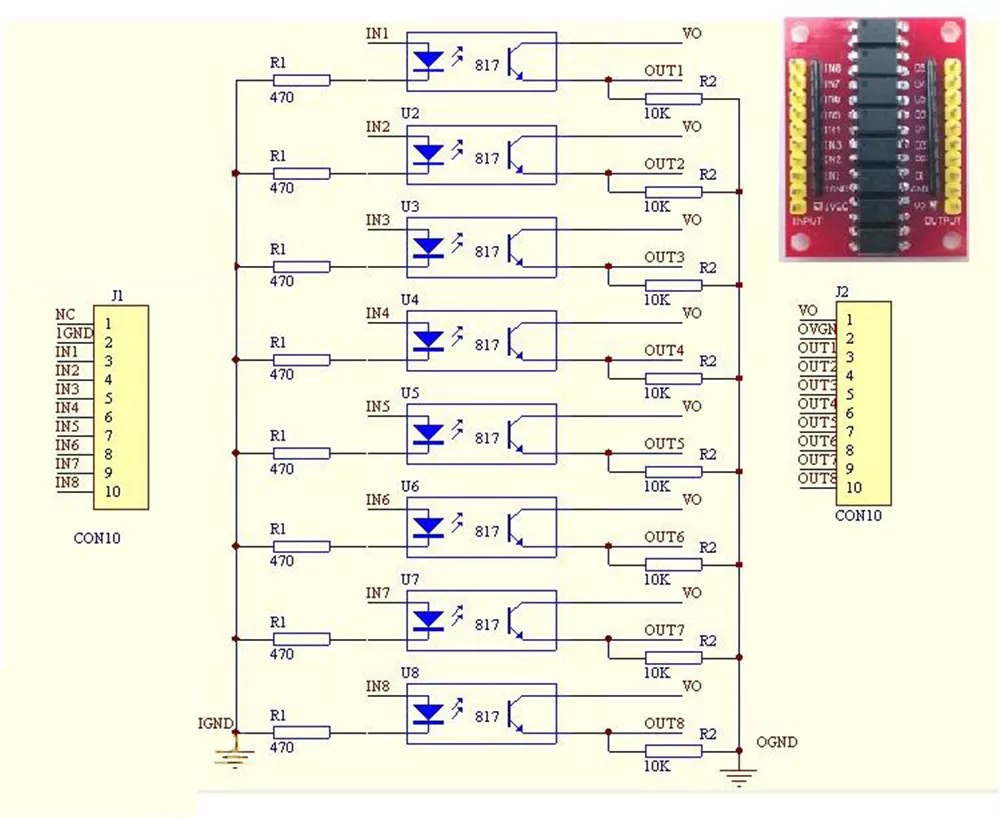

# televa_703_control

## Kuvaus
Televa 703-LYVV on väestönsuojeluradio johon on asetettu valmiiksi neljä kanavaa. Kanavarummussa on tilaa 12 kanavalle.
Tässä toteutuksessa otetaan yksi tyhjä kanava käyttöön ja ohjataan ulkoisella laitteella (raspi, esp32, ...) diodimatriisia. Näin saadaan laite laajennettua käyttämään joustavasti muitakin kanavia kuin vain kiinteästi asetettuja.

Taajuuden asetus on toteutettu PLL piirillä jota ohjataan yhdeksän bittisellä jakoluvulla. 703:ssa jakoluvun alin bitti on kiinteästi nolla joten se käyttää kahdeksaa ylintä bittiä. Näin saadaan 25 kHz askellus aikaiseksi.
Perustaajuus on 160.325 MHz.

Halutun taajuuden jakoluku = (haluttu taajuus-160.325 MHz) / 0.025 MHz

Kiinteät kanavataajuudet on toteutettu diodimatriisilla jossa kanava kohtaisesti ohjataan jännite diodien läpi haluttuun PLL:n pinniin niin että saadaan haluttu jakoluku. PLL piirissä on sisäinen alasveto jakoluku pinneissä. Pinnin ollessa alasvedetty se vastaa nollaa ja ollessaan jänniitteellinen se vastaa ykköstä.

Uusi kanava kontrolli toteutetaan niin että radion sisään laitetaan 16-kanavainen i2c ohjattava io-expander ja 8-kanavainen optoerotin tasomuuntimeksi.

Optoerottimen ulostulon jännitte otetaan kanavavalitsimen viimeisen kanavan lähdöstä. Ulostuloihin kytketään diodit päästösuuntaan ja johdotetaan diodimatriisiin (piikkirimalle?).

Jännite io-expanderille ja optoerottimen input puolelle otetaan regulaattorin avulla radion käyttöjännitteestä.

Käyttöjännite (3.3V tai 5V), maa, I2C ja kohinasalvan tilatieto johdotetaan radion takana olevaan 5-napaiseen DIN-liittimeen.

## Kontrolli HW

Optoerotin modulin sisäinen kytkentä

## Kontrolli SW
Kontrolli HW:tä ohjataan aluksi raspberry pi:llä ja siihen tehdyllä python sovelluksella.

Seuraavassa vaiheessa on tarkoitus korvata raspberry pi jollain esp32 tyylisellä mikrokontrollerilla johon voi tehdä web sovelluksen jolla ohjataan radiota i2c väylän kautta.
Ohjelman on tarkoitus luoda wlan AP:n ja myös mahdollistaa liittymisen suoraan omaan wlan verkkoon.

Kohinasalvan tilatietoa on tarkoitus käyttää taajuusalueen skannauksen tai muistipaikkojen skannauksessa saamaan tieto kanavalla olevasta liikenteestä. Linja kytketään gpio:n josta joko pollaamalla tai keskeytyksen kautta saadaan tieto kohinasalvan aukeamisesta ja sulkeutumisesta.

### Raspberry Pi
kuva kälistä

### ESP32
kuva kälistä

## GIT
[Televa 703-LYVV Control](https://github.com/oh3bsg/televa_703_control)

## Linkkejä
- [Televa703 AIS](https://wiki.sral.fi/wiki/Televa703_AIS)
- [Televa703](https://wiki.sral.fi/wiki/Televa703)
- [Televa 800](http://oh3tr.fi/suomi/moppeakatemia/televa800.shtml)
- [Moppeakatemia](http://oh3tr.fi/suomi/moppeakatemia)
- [MCU-2317 MCP23017 - I2C 16-Bit I/O Expander](https://www.ebay.com/itm/154938928049?_skw=MCP23017&itmmeta=01JE4KNHE8BE6QAQTQR55Z8GG7&hash=item2413146bb1:g:72wAAOSwyMVnRIfp&itmprp=enc%3AAQAJAAAA4HoV3kP08IDx%2BKZ9MfhVJKkKN32HxD1zj3SsAk5ZRw6R2oqfEPniaOIU7fTBAnb2msJi%2BIqOFPvyGFM%2FFp6wWBSiAgY9NBaDQ6lVfGMb2eiiqyrutFUQ472RZAj85LqdFOBV8H7l%2F9ssoOHuee3cAlaTXt8Ef%2BAb58weLJRKrb8gA0eD350ItY2Ag6%2FVYd1niKkaR%2FrpH%2FqKmIYWq9I8i%2FO6WnbMHmdbDuuHgrJ9ouRUsLVDfqEHtjwaZDpVjBuXmkRqIVj9Jla6InU89ChUtFyd%2Bsag0sGUbi2%2Bvjdsj9wZ%7Ctkp%3ABFBMnJfWk_Fk)
- [12V 8-Channel High Level Trigger Module Optocoupler Insulation Board](https://www.ebay.com/itm/173581464657)
- [raspberry pi pinout](https://pinout.xyz/pinout/i2c)

---
OH3BSG
